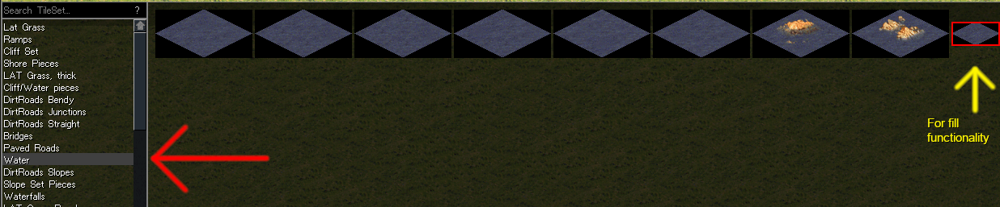
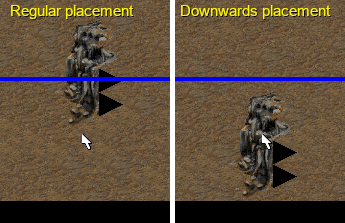
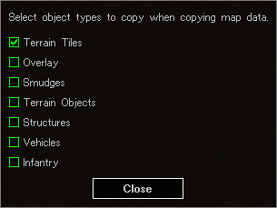
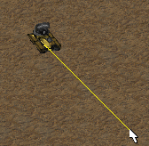
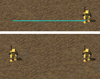

# World-Altering Editor User Manual

We try to make the editor's user interface intuitive, but in case it is not enough, this guide contains some helpful tips and tricks.

**Note:** Most keybinds mentioned here can be changed in the *Keyboard Options* menu. This guide assumes you use the defaults.

## Painting terrain

To paint terrain, select a tile from either the top bar or from the TileSet selector in the bottom of the screen. Then you can simply click to place it on the map.

**To fill an enclosed area**, select a 1x1 sized tile and click on the area while holding Ctrl. This logic is similar to the "bucket tool" in MS Paint and many other image and map editors.

### Painting water

To paint water, select the Water TileSet from the TileSet selector in the bottom of the screen. Then a tile and paint. You can increase the brush size to cover larger areas, or use the fill functionality mentioned above.

Note that the fill functonality only works with 1x1 sized tiles.

### But my water looks all samey if I only use the 1x1 tile?

Once you are done detailing the map, you can run *Tools -> Run Script... -> Smoothen Water.cs*. The script will randomize all the water tiles on the map.

### Placing terrain at the southern edge of the map

Normally, terrain tiles are placed above the cursor. This can make placing terrain tiles at the southern edge of the map inconvenient. In this situation, you can hold Alt to place the tile below the cursor instead of above the cursor.

## Copy and paste

Like in most programs, Ctrl+C and Ctrl+V keys enable regular rectangular copy and paste features. They can also be accessed from the Edit menu.

Alt+C activates a tool for copying a custom-shaped area.

### Copying more than just terrain

Sometimes you might want to copy more than just terrain: buildings, units, trees, overlay etc. You can select what map elements are copied from *Edit -> Configure Copied Objects*.

## Objects

### Rotating units

To rotate a unit, hover over it with the mouse cursor. Then **press and hold** the *Rotate Unit* key (default: A) on your keyboard, and drag the unit with the mouse to the direction that you want the unit to face.

### Deleting objects

The fastest way to delete an object is to hover over it with the mouse cursor and press the Delete key on your keyboard.

An alternative way is pressing the *Deletion Mode* button at the top bar. It activates a deletion cursor that you can use to delete objects by clicking on them on the map.

### Overlapping objects

By default, WAE prevents you from overlapping objects (placing multiple units or buildings on the same cell) to make it harder to do accidentally. This is especially important for Tiberian Sun as the game can crash if multiple buildings overlap - a common mistake in fan-made maps.

If you intentionally want to overlap objects, hold Alt while placing or moving an object and WAE allows you to overlap them.

### Cloning objects

To quickly clone an object, with all of its properties (Attached Tag, HP, Facing etc.), hold Shift and drag the object with the mouse. When you release the left mouse button, WAE creates a clone of the object in the position.

## Zooming

You can zoom in and out with the scroll wheel.

If you want to reset to the default zoom level, press `Ctrl + 0` on your keyboard. Just like in your web browser.

## Fullscreen mode

You can toggle fullscreen mode on or off by pressing F11, regardless of whether you launched WAE in fullscreen or windowed mode.

If you have a multi-monitor setup, when maximized with F11, WAE fills the monitor that its window happened to be on at the time of pressing F11.

## Auto-save

WAE automatically saves a backup of your map every few minutes to prevent data loss in case of crash of the system or editor.

**Auto-save does not overwrite your open map file**, but instead the save is written as `autosave.map` inside WAE's directory. If you encounter a crash or other issues that would cause work to be lost, you can find the `autosave.map` file from WAE's directory, copy it and continue your work from it.